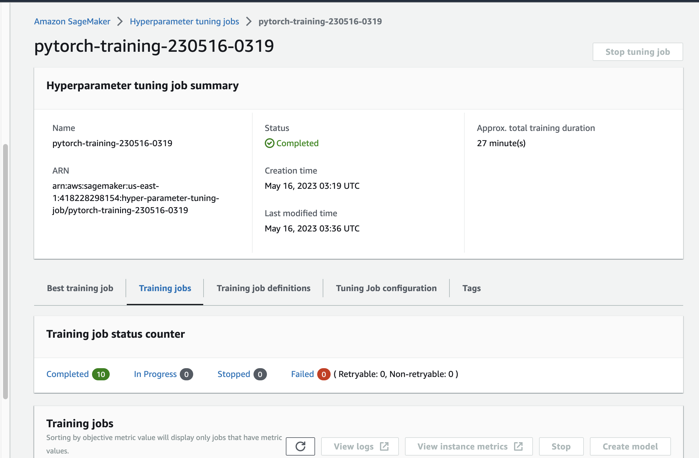
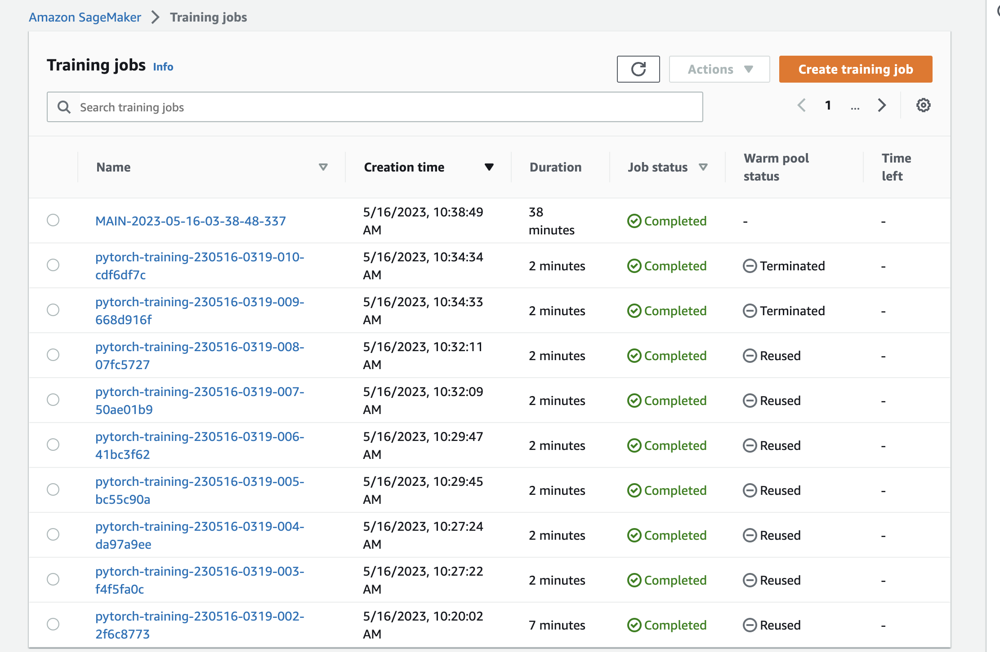
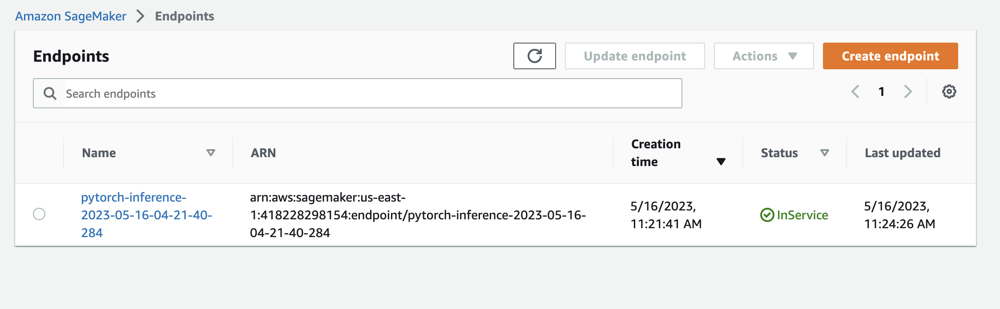

# Image Classification using AWS SageMaker

Use AWS Sagemaker to train a pretrained model that can perform image classification by using the Sagemaker profiling, debugger, hyperparameter tuning and other good ML engineering practices. This can be done on either the provided dog breed classication data set or one of your choice.

## Project Set Up and Installation
Enter AWS through the gateway in the course and open SageMaker Studio. 
Download the starter files.
Download/Make the dataset available. 

## Dataset
The provided dataset is the dogbreed classification dataset which can be found in the classroom.
The project is designed to be dataset independent so if there is a dataset that is more interesting or relevant to your work, you are welcome to use it to complete the project.

### Access
Upload the data to an S3 bucket through the AWS Gateway so that SageMaker has access to the data. 

## Hyperparameter Tuning
What kind of model did you choose for this experiment and why? Give an overview of the types of parameters and their ranges used for the hyperparameter search

- In our experiment, the ResNet50 model was employed for image classification. To identify the ideal values for the learning rate and batch size, we executed a hyperparameter search using the hpo.py script. We explored a continuous range of 0.001 to 0.1 for the learning rate, and for the batch size, we investigated a categorical set including 16, 32, 64, 128, 256, and 512. Once we determined the optimal learning rate and batch size, we utilized these values to train the model over 20 epochs

<!-- Remember that your README should:
- Include a screenshot of completed training jobs
- Logs metrics during the training process
- Tune at least two hyperparameters
- Retrieve the best best hyperparameters from all your training jobs -->



- We proceeded to train the model through the train.py script. After undergoing 20 epochs, the model concluded its training with an accuracy of approximately `80.62%` a figure that indicates room for enhancement.



## Debugging and Profiling

- Debugging of the model within SageMaker is facilitated by the smdebug library, a component of the SageMaker Python SDK. This library provides hooks that capture tensor values at various stages during the training process, along with a set of rules for identifying common training issues.

- In our case, we employed Amazon SageMaker Debugger to scrutinize the model's training performance.

- We integrated the model by establishing an SMDebug hook within the main function, which was then passed on to both train and test functions with TRAIN and EVAL modes respectively.

- We set up Debugger Rules and Hook Parameters to monitor specific aspects, as outlined in the train_and_deploy.ipynb notebook.

- Should the debugging output exhibit irregularities, it would be necessary to diagnose and rectify the issue with the model.

- This could be achieved by examining the CloudWatch logs and making the necessary adjustments to the code.

- We utilized SageMaker Profiler to track instance metrics, as well as GPU/CPU utilization and memory usage. In order to employ the SageMaker Profiler, we established specific profiler rules and configurations. The resulting output was a comprehensive HTML report.

### Results
<!-- **TODO**: What are the results/insights did you get by profiling/debugging your model? -->

- The report indicated an underutilization of the GPU by the model. Based on these observations, the suggested course of action was to enhance the batch size or to opt for a smaller instance type.

<!-- **TODO** Remember to provide the profiler html/pdf file in your submission. -->


## Model Deployment
<!-- **TODO**: Give an overview of the deployed model and instructions on how to query the endpoint with a sample input. -->

- The model that we deployed is a Convolutional Neural Network (CNN) based on the PyTorch implementation of ResNet50. This model was specifically fine-tuned for the task of Dog Breed Classification. Given that there are 133 unique dog breeds in the provided dataset, it features a fully connected output layer with an output size of 133. To achieve optimal results as per our hyperparameter tuning, we applied a learning rate of 0.001, a batch size of 16, and early stopping rounds set to 12.



<!-- **TODO** Remember to provide a screenshot of the deployed active endpoint in Sagemaker. -->

## Standout Suggestions
<!-- **TODO (Optional):** This is where you can provide information about any standout suggestions that you have attempted. -->

- To query the enpoint we have to get the endpoint using:

```bash
predictor = sagemaker.predictor.Predictor('pytoch-inference-2023-05-16-04-21-40-284', 
                                           sagemaker_session=sagemaker_session)
```

- Before the sample image can be fed into the predictor.predict() function, it must undergo a series of transformations, including resizing, conversion into a tensor, and normalization.